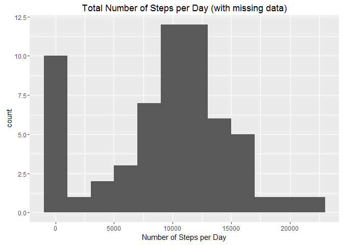
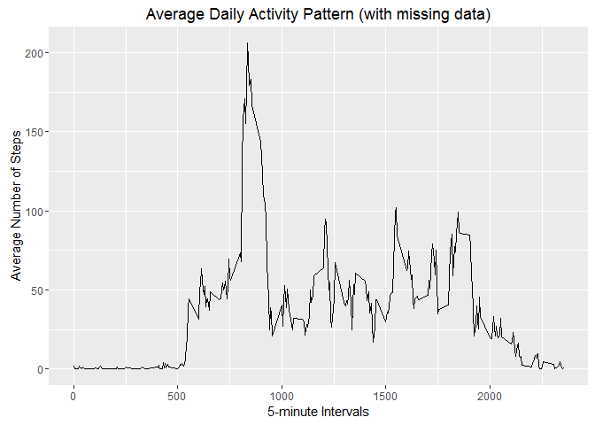
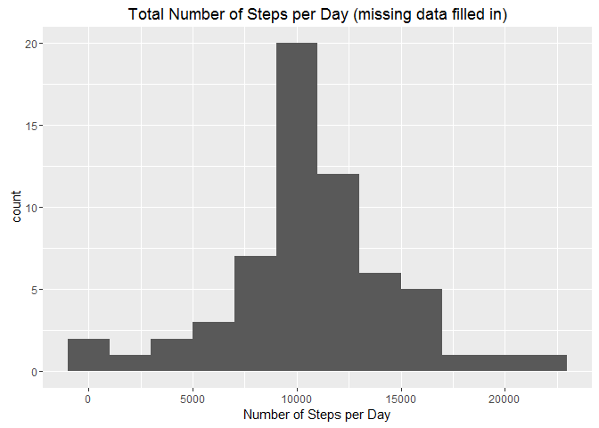
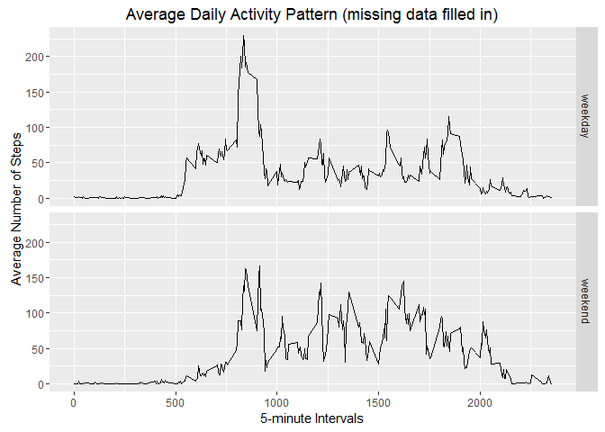

# Reproducible Research: Peer Assessment 1


## Loading and preprocessing the data
* Loading packages


```r
library(ggplot2)
library(dplyr)
```

```
## 
## Attaching package: 'dplyr'
```

```
## The following objects are masked from 'package:stats':
## 
##     filter, lag
```

```
## The following objects are masked from 'package:base':
## 
##     intersect, setdiff, setequal, union
```

1. Loading the dataset


```r
unzip("activity.zip") 
df <- read.csv("activity.csv")
```

2. Transforming  the data into a format suitable for analysis


```r
df$date<-as.Date(df$date)
head(df)
```

```
##   steps       date interval
## 1    NA 2012-10-01        0
## 2    NA 2012-10-01        5
## 3    NA 2012-10-01       10
## 4    NA 2012-10-01       15
## 5    NA 2012-10-01       20
## 6    NA 2012-10-01       25
```

## What is mean total number of steps taken per day?
* Note: The missing values in the dataset are ignored

1. Calculating the total number of steps taken per day


```r
df_sum_by_date<-summarize(group_by(df, date), steps = sum(steps, na.rm = TRUE))
```

2. Making a histogram of the total number of steps taken each day


```r
qplot(steps, data = df_sum_by_date, binwidth=2000, xlab= "Number of Steps per Day", main = "Total Number of Steps per Day (with missing data)")
```



3. Calculating the mean and median of the total number of steps taken per day


```r
mean(df_sum_by_date$steps) 
```

```
## [1] 9354.23
```

```r
median(df_sum_by_date$steps)
```

```
## [1] 10395
```

## What is the average daily activity pattern?
1. Makeing a time series plot of the 5-minute interval and the average number of steps taken, averaged across all days

* Calculating the mean of steps taken per interval


```r
df_mean_by_interval<-summarize(group_by(df, interval), steps_mean = mean(steps, na.rm = TRUE))
```

* Makeing a time series plot


```r
ggplot(df_mean_by_interval, aes(interval, steps_mean)) + 
    geom_line() + 
    xlab("5-minute Intervals") + 
    ylab("Average Number of Steps") + 
    ggtitle("Average Daily Activity Pattern (with missing data)")
```



2. Identifying the 5-minute interval that, on average across all the days in the dataset contains the maximum number of steps


```r
df_mean_by_interval[which.max(df_mean_by_interval$steps_mean),]$interval
```

```
## [1] 835
```

## Imputing missing values
1. Calculating the total number of missing values in the dataset (i.e. the total number of rows with NAs)


```r
sum(is.na(df$steps))
```

```
## [1] 2304
```

2. Filling in all of the missing values in the dataset
* Note: NA steps are imputed from mean of steps taken per interval

3. Creating a new dataset that is equal to the original dataset but with the missing data filled in.


```r
df_imputed<-df %>% left_join (df_mean_by_interval,by="interval") %>% mutate(steps=ifelse(is.na(steps),steps_mean,steps)) %>% select(-c(steps_mean))
```

4. Making a histogram of the total number of steps taken each day

* Calculating the total number of steps taken per day


```r
df_imputed_sum_by_date<-summarize(group_by(df_imputed, date), steps = sum(steps, na.rm = TRUE))
```

* Making a histogram


```r
qplot(steps, data = df_imputed_sum_by_date, binwidth=2000, xlab= "Number of Steps per Day", main = "Total Number of Steps per Day (missing data filled in)")
```



* Calculating the mean and median of the total number of steps taken per day


```r
mean(df_imputed_sum_by_date$steps) 
```

```
## [1] 10766.19
```

```r
median(df_imputed_sum_by_date$steps)
```

```
## [1] 10766.19
```
These values differ from the estimates from the first part of the assignment

Imputing missing data increaces the total daily number of steps

## Are there differences in activity patterns between weekdays and weekends?
* Note: Dataset with the filled-in missing values is used.

1. Creating a new factor variable in the dataset with two levels - "weekday" and "weekend" indicating whether a given date is a weekday or weekend day.


```r
df_imputed<- mutate(df_imputed,weekend=factor(ifelse(weekdays(date) %in% c("Saturday","Sunday"),"weekend","weekday"),levels=c("weekday","weekend")))
```

2. Making a panel plot containing a time series plot of the 5-minute interval and the average number of steps taken, averaged across all weekday days or weekend days.

* Calculating the mean of steps taken per interval


```r
df_imputed_mean_by_interval<-summarize(group_by(df_imputed, interval,weekend), steps_mean = mean(steps, na.rm = TRUE))
```

* Makeing a panel plot


```r
ggplot(df_imputed_mean_by_interval, aes(interval, steps_mean)) + 
    geom_line() + 
    facet_grid(~weekend~.) +
    xlab("5-minute Intervals") + 
    ylab("Average Number of Steps") + 
    ggtitle("Average Daily Activity Pattern (missing data filled in)")
```



* Morning activity is highest during weekdays, the overall activity is higher on weekends.
